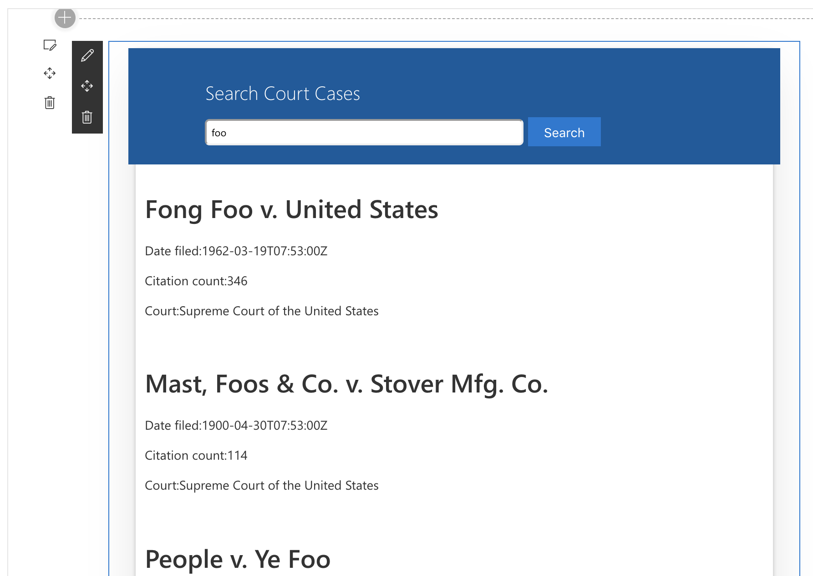

# Case-Search
A Sharepoint webpart which has the abillity to search for US Court Cases.  This webpart is a simple input bar with search button which displays the results below the form.



## Getting Started

These instructions will get you a copy of the project up and running on your local machine for development and testing purposes. 

### Prerequisites

What things you need to install the software and how to install them

```
npm - https://www.npmjs.com/get-npm
gulp - https://gulpjs.com/
```

### Installing

A step by step series of examples that tell you how to get a development env running

From the proejcts root directory.

Install the dependencies:
```
npm install
```

build artifacts and scripts:
* lib/* - intermediate-stage commonjs build artifacts
* dist/* - the bundled script, along with other resources
* deploy/* - all resources which should be uploaded to a CDN.

```
gulp
```

run on local server

```
gulp serve
```

## Deployment
To bundle the webpart into a package from the root directory type
```
gulp bundle
```

## License

This project is licensed under the MIT License - see the [LICENSE.md](LICENSE.md) file for details